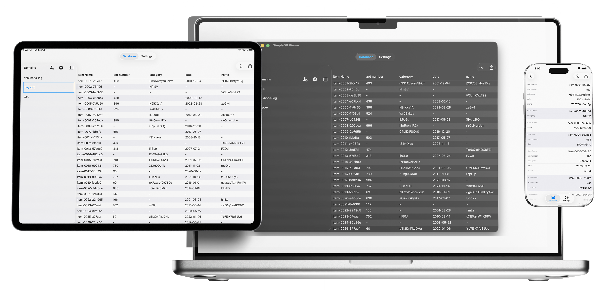

**simpledbviewer-ios** is a small iOS app for browsing **Amazon SimpleDB**: connect with AWS access keys, list domains, inspect items as a table, run `SELECT` style queries with validation, and export or share results as CSV. Credentials live in the `Keychain`; lightweight preferences use `UserDefaults`. Older installs can migrate legacy data from a `Core Data` store into the current storage model.

Rewriting this project was an attempt to practice Clean Architecture and Unidirectional Dataflow. The project is organized in layers: domain (entities, use cases, repository protocols), data (SimpleDB/AWS SDK, Keychain, UserDefaults, legacy Core Data, temporary files for export), and SwiftUI UI (home, tabular data, settings, add/manage credentials). There is an external dependency to AWS SDK for iOS which is pulled via SPM. Unit tests cover error mapping, use cases, repositories, and key view models.

Requirements: Xcode 16+ and valid AWS credentials (access keys) for testing. You can follow this guide to get your keys [https://docs.aws.amazon.com/IAM/latest/UserGuide/id_credentials_access-keys.html](https://docs.aws.amazon.com/IAM/latest/UserGuide/id_credentials_access-keys.html).

## License

This project is licensed under the PolyForm Shield License 1.0.0.

You are welcome to view and learn from the source code.

However, you may NOT:
- Use this code in production
- Redistribute this code
- Repackage or sell this project (or derivatives)

See the LICENSE file for full terms.